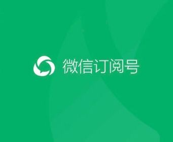

## 中控服务器



### 架构设计


  主要有三个部分：负责业务逻辑部分的服务器，负责对接微信API的API-Proxy服务器，以及唯一的AccessToken中控服务器


1. AccessToken中控服务器（即wxaccesstoken服务）：

  负责： 提供主动刷新和被动刷新机制来刷新accessToken并存储（为了防止并发刷新，注意加并发锁），提供给业务逻辑有效的accessToken。

  优点： 避免业务逻辑方并发获取access_token，避免AccessToken互相覆盖，提高业务功能的稳定性。

2. API-Proxy服务器：

  负责：专一与微信API对接，不同的服务器可以负责对接不同的业务逻辑，更可进行调用频率、权限限制。

  优点：某台API-proxy异常，还有其余服务器支持继续提供服务，提高稳定性，

  避免直接暴漏内部接口，有效防止恶意攻击，提高安全性

### 服务的功能定义

 提供一个统一的token获取中心服务

#### 问题的产生

1. token存在时效性.以及访问次数限制
  - token的失效为两个小时7200s,因此我们需要一个在过期前自动刷新获取token的机制，来保证每次获取的token都是有效的
  - 每天的访问次数为20000次，如果每次访问都直接从微信服务器获取一次token，很快超过了调用次数，整个服务将无法工作。
2. 系统各自刷新导致的问题

  - 虽然各个系统可以保存有效时间，但是并发情况下，服务调用会相互覆盖token，虽然新老token有五分钟的平滑过渡期，但是一旦在过渡期之外，会导致一个能用，其他的服务就会瘫痪。
  - 因此我们需要一个中控服务器来统一管理token。

#### 架构的优势

1. 所有的服务都通过token中控服务器获取token
2. 每隔(7200-200)*1000毫秒刷新token，保证一天的获取次数不会超过20000次，保证了服务的可用
3. 中控服务器维护一个token的缓存，并且保证了token一定可用。并发情况下都是拿到同一个token.不存在token互相覆盖的问题

#### 架构的实现

##### 程序启动初始化获取token

```java
@Component
@Order(value = 1)
public class InitWxTokenRunner implements ApplicationRunner {
    @Autowired
    private WxAccessTokenService wxAccessTokenService;
    @Override
    public void run(ApplicationArguments args) throws Exception {
        new Thread(new Runnable() {
            @Override
            public void run() {
                wxAccessTokenService.autoRefreshToken();
            }
        }).start();
    }
}

```


##### 程序内Http请求配置

RestTemplate配置1.

```java
@Configuration
public class RestTemplateConfig {
    @Bean
    RestTemplate restTemplate(){
        SimpleClientHttpRequestFactory requestFactory = new  SimpleClientHttpRequestFactory();
        requestFactory.setConnectTimeout(1000);
        requestFactory.setReadTimeout(1000);
        RestTemplate restTemplate = new RestTemplate(requestFactory);
        restTemplate.getMessageConverters().set(1, new StringHttpMessageConverter(StandardCharsets.UTF_8));
        return restTemplate;
    }

}
```
RestTemplate配置2（跳过https验证）

```java
 @Bean
    public RestTemplate buildRestTemplate() throws KeyStoreException, NoSuchAlgorithmException, KeyManagementException {
        HttpComponentsClientHttpRequestFactory factory = new
                HttpComponentsClientHttpRequestFactory();
        factory.setConnectionRequestTimeout(1000);
        factory.setConnectTimeout(1000);
        factory.setReadTimeout(1000);
        // https
        SSLContextBuilder builder = new SSLContextBuilder();
        builder.loadTrustMaterial(null, (X509Certificate[] x509Certificates, String s) -> true);
        SSLConnectionSocketFactory socketFactory = new SSLConnectionSocketFactory(builder.build(), new String[]{"SSLv2Hello", "SSLv3", "TLSv1", "TLSv1.2"}, null, NoopHostnameVerifier.INSTANCE);
        Registry<ConnectionSocketFactory> registry = RegistryBuilder.<ConnectionSocketFactory>create()
                .register("http", new PlainConnectionSocketFactory())
                .register("https", socketFactory).build();
        PoolingHttpClientConnectionManager phccm = new PoolingHttpClientConnectionManager(registry);
        phccm.setMaxTotal(200);
        CloseableHttpClient httpClient = HttpClients.custom().setSSLSocketFactory(socketFactory).setConnectionManager(phccm).setConnectionManagerShared(true).build();
        factory.setHttpClient(httpClient);
        RestTemplate restTemplate = new RestTemplate(factory);
        return restTemplate;
    }
```

##### 自动刷新获取token程序

```java
@Service
public class WxAccessTokenService {
    private static final Logger logger = LoggerFactory.getLogger(WxAccessTokenService.class);
    private static final String GET_ACCESS_TOKEN_URL = "https://api.weixin.qq.com/cgi-bin/token?grant_type={grant_type}&appid={appid}&secret={secret}";
    @Value("${wx.appid}")
    private String appid;
    @Value("${wx.secret}")
    private String secret;
    private volatile AccessToken accessToken;

    @Autowired
    private RestTemplate restTemplate;

    public AccessToken getAccessToken() {
        return accessToken;
    }

    public void autoRefreshToken() {
        while (true) {
            logger.info("autoRefreshToken 启动");
            try {
                AccessToken token = getAccessToken(this.appid, this.secret);
                if (null != token) {
                    this.accessToken = token;
                }
                if (null != accessToken) {
                    Thread.sleep((accessToken.getExpires_in() - 200) * 1000);
                } else {
                    Thread.sleep(60 * 1000);
                }
            } catch (Exception e) {
                try {
                    Thread.sleep(5 * 1000);
                } catch (InterruptedException e1) {
                    e1.printStackTrace();
                }
                logger.error("gettoken error",e);
            }
        }
    }

    /**
     * @param appid
     * @param secret
     * @return
     */
    public AccessToken getAccessToken(String appid, String secret) {
        Map<String, String> params = new HashMap<>();
        params.put("grant_type", "client_credential");
        params.put("appid", appid);
        params.put("secret", secret);
        ResponseEntity entity = restTemplate.getForEntity(GET_ACCESS_TOKEN_URL, String.class, params);
        if (entity.getStatusCode().value() == 200) {
            logger.info("成功获取token");
            logger.info(entity.getBody().toString());
            String token = entity.getBody().toString();
            JSONObject jsonObject = JSON.parseObject(token);
            if (jsonObject.containsKey("access_token")) {
                AccessToken accessToken = JSONObject.parseObject(token, AccessToken.class);
                return accessToken;
            }
        }
        logger.info("获取token失败");
        return null;
    }
}
```

##### 为需要token的服务提供接口

```java
@RestController
@RequestMapping("/accesstoken")
public class AccessTokenController {
    @Autowired
    private WxAccessTokenService wxAccessTokenService;

    @GetMapping("/token")
    public RestResult getAccessToken() {
        AccessToken accessToken = wxAccessTokenService.getAccessToken();
        if (accessToken != null && accessToken.getAccess_token() != null) {
            return  RestResult.getSucceedResult(accessToken);
        }else{
            return RestResult.getFailedResult("fetch token failed");
        }
    }


}
```

##### pom依赖

```xml
   <dependencies>
        <dependency>
            <groupId>org.springframework.boot</groupId>
            <artifactId>spring-boot-starter-web</artifactId>
        </dependency>

        <dependency>
            <groupId>org.springframework.boot</groupId>
            <artifactId>spring-boot-starter-test</artifactId>
            <scope>test</scope>
        </dependency>

        <dependency>
            <groupId>com.alibaba</groupId>
            <artifactId>fastjson</artifactId>
            <version>1.2.51</version>
        </dependency>
        
        <dependency>
            <groupId>org.apache.httpcomponents</groupId>
            <artifactId>httpclient</artifactId>
            <version>4.5.3</version>
        </dependency>

    </dependencies>
```

