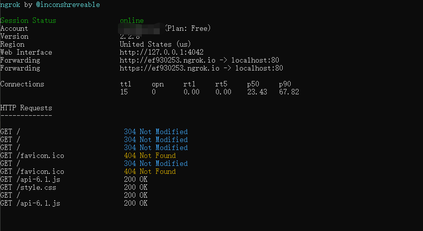
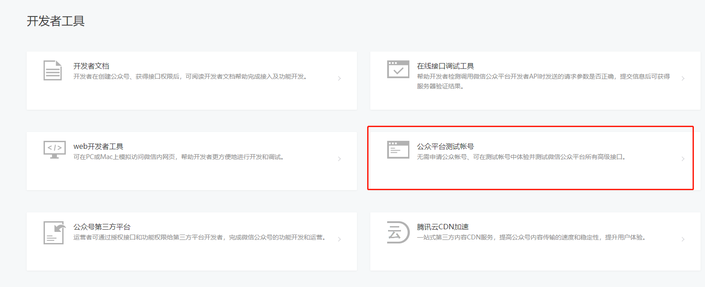
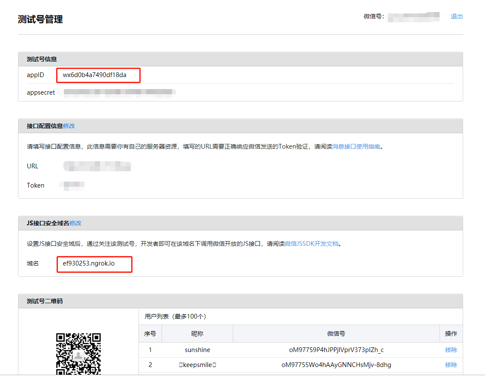

### 微信订阅号如何搭建本地测试环境

免费工具：

[nginx工具包下载](https://nginx.org/en/download.html) 

[ngrok内网穿透工具下载](https://ngrok.com/) 可能需要翻墙，国内也有些类似工具。

[js_sdk_DEMO下载](https://github.com/henryluki/Weixin_Js_SDK.git)

nginx 主要用于发布网页服务的。

ngrok 做内网穿透使用，与本地端口映射，使在本地能发布服务使外网可见

demo 用于做测试

#### ngrok安装以及使用

1. 解压安装包
2. ngrok授权 ngrok authtoken 授权码
3. 设置需要代理的本地端口 ngrok http 80 
4. 详情官网查看

运行成功截图：



然后就可以通过  http://ef930253.ngrok.io 外网访问本地80端口了，前提是你电脑能上网

#### nginx 

1. nginx windows版下载
2. 将js_sdk_DEMO，含有index.html界面所有文件拷贝到nginx的html页面
2. 解压文件配置nginx（/nginx/conf/nginx.conf）,这个serverName应当与上面ef930253.ngrok.io域名一致，否则在调用js Sdk时会出现 无效签名的错误。（后面细说）
```json
 server {
        listen       80;
        server_name  ef930253.ngrok.io;

        #charset koi8-r;

        #access_log  logs/host.access.log  main;

        location / {
            root   html;
            index  index.html index.htm;
        }

        #error_page  404              /404.html;

        # redirect server error pages to the static page /50x.html
        #
        error_page   500 502 503 504  /50x.html;
        location = /50x.html {
            root   html;
        }

```
### 测试微信公众号准备

1. 申请完公众号做开发不一定得验证（收费每年300）
2. 登录微信公众平台后，左侧导航栏 点击 **开发者工具**
3. 选择公众平台测试账号



4. 进入公众号测试界面



5. 如上图所示配置js接口安全域  也就是做前面生成的域名 **http://ef930253.ngrok.io** 不需要http前缀，如上图所示。

### 后端接入测试号(当然以下代码都是狗屎)

1. 前端通过传递哪个页面要调用js sdk的url给后端，后端返回如下参数

    - ticket 用于校验的值 
    - noncestr 随机字符串
    - signature 签名
    - timestamp 生成签名的时间戳

```java
@RestController
public class WxJSApiController {
    private static final Logger logger = LoggerFactory.getLogger(WxJSApiController.class);
    @Autowired
    private WxTokenService wxTokenService;

    @GetMapping("/jsApiAccessConfig")
    public RestResult<?> jsApiAccessConfig(String targetUrl) {
        String token = wxTokenService.getToken();
        Map<String, String> map = JsapiTicketUtil.JsapiTicket(token);
        String noncestr = UUID.randomUUID().toString().replace("-", "").substring(0, 16);
        String timestamp = String.valueOf(System.currentTimeMillis() / 1000);

        if (map.containsKey("ticket")) {
            String str = "jsapi_ticket=" + map.get("ticket") + "&noncestr=" + noncestr + "&timestamp=" + timestamp + "&url=" + targetUrl;
            String signature = SHAUtil.encode(str);
            logger.info(signature);
            Map<String, String> mapResult = new HashMap();
            mapResult.put("timestamp", timestamp);
            mapResult.put("ticket", map.get("ticket"));
            mapResult.put("noncestr", noncestr);
            mapResult.put("signature", signature);
            RestResult<?> restResult = RestResult.getSucceedResult("data", mapResult);
            return restResult;
        }
        return RestResult.getFailedResult(RestResult.ErrorCode.FAILURE_TO_OBTAIN_JS_ACCESS_INFO);
    }

}
```
2. ticket获取
```java
public class JsapiTicketUtil {
    private static final Logger logger = LoggerFactory.getLogger(JsapiTicketUtil.class);
    public final static String GetPageAccessTokenUrl = "https://api.weixin.qq.com/cgi-bin/ticket/getticket?access_token=ACCESS_TOKEN&type=jsapi";

    public static Map<String, String> JsapiTicket(String accessToken) {

        String requestUrl = GetPageAccessTokenUrl.replace("ACCESS_TOKEN", accessToken);
        RestTemplate restTemplate = new RestTemplate();
        Map<String, String> result = new HashMap<String, String>();
        try {
            ResponseEntity<String> response = restTemplate.getForEntity(requestUrl, String.class);
            String responseResult = response.getBody();
            JSONObject OpenidJSONO = JSONObject.parseObject(responseResult);
            String errcode = String.valueOf(OpenidJSONO.get("errcode"));
            String errmsg = String.valueOf(OpenidJSONO.get("errmsg"));
            String ticket = String.valueOf(OpenidJSONO.get("ticket"));
            String expires_in = String.valueOf(OpenidJSONO.get("expires_in"));
            result.put("errcode", errcode);
            result.put("errmsg", errmsg);
            result.put("ticket", ticket);
            result.put("expires_in", expires_in);
        } catch (Exception e) {
            logger.error("JsapiTicketUtil", e);
        }
        return result;
    }

}

```
3. 签名生成工具SHAUtil

```java
    String str = "jsapi_ticket=" + map.get("ticket") + "&noncestr=" + noncestr + "&timestamp=" + timestamp + "&url=" + targetUrl;
            String signature = SHAUtil.encode(str);
```

SHAUtil

```java
public class SHAUtil {
    private static final char[] HEX_DIGITS = {'0', '1', '2', '3', '4', '5',
            '6', '7', '8', '9', 'a', 'b', 'c', 'd', 'e', 'f'};

    /**
     * Takes the raw bytes from the digest and formats them correct.
     *
     * @param bytes the raw bytes from the digest.
     * @return the formatted bytes.
     */
    private static String getFormattedText(byte[] bytes) {
        int len = bytes.length;
        StringBuilder buf = new StringBuilder(len * 2);
        // 把密文转换成十六进制的字符串形式
        for (int j = 0; j < len; j++) {
            buf.append(HEX_DIGITS[(bytes[j] >> 4) & 0x0f]);
            buf.append(HEX_DIGITS[bytes[j] & 0x0f]);
        }
        return buf.toString();
    }

    public static String encode(String str) {
        if (str == null) {
            return null;
        }
        try {
            MessageDigest messageDigest = MessageDigest.getInstance("SHA1");
            messageDigest.update(str.getBytes());
            return getFormattedText(messageDigest.digest());
        } catch (Exception e) {
            throw new RuntimeException(e);
        }
    }
}
```

4. 解决跨域问题

```java
@Configuration
@EnableWebMvc
public class WebConfig implements WebMvcConfigurer {

    @Override
    public void addCorsMappings(CorsRegistry registry) {
        // Enable CORS globally
        registry.addMapping("/**");
    }
}
```

5. 判断生成的界面是否正确

    - 调用后端api获取所需参数 http://118.26.173.16/jsApiAccessConfig?targetUrl=http://ef930253.ngrok.io/ 这里的targetUrl 一定要是你的调用界面的url

   - 将返回的ticket、noncestr、timestamp以及你的url填写到 **[微信签名校验工具](https://mp.weixin.qq.com/debug/cgi-bin/sandbox?t=jsapisign)**。如果生成的signature，与返回的signature一致，说明签名没有问题

还有些其他的内容前面系列都有介绍。

#### 配置js sdk demo 的index.html页面
修改timestamp、nonceStr、signature、与后端返回的一致。appId就是测试公众号的唯一id

```js
<script>
  wx.config({
      debug: true,
      appId: 'wx6d0b4a7490df18da',
      timestamp: 1544672390,
      nonceStr: '2c50561948814abd',
      signature: 'a6aea06e089f43f4dea50c81b73efeb1c4786d39',
      jsApiList: [
        'checkJsApi',
        'onMenuShareTimeline',
        'onMenuShareAppMessage',
        'onMenuShareQQ',
        'onMenuShareWeibo',
        'hideMenuItems',
        'showMenuItems',
        'hideAllNonBaseMenuItem',
        'showAllNonBaseMenuItem',
        'translateVoice',
        'startRecord',
        'stopRecord',
        'onRecordEnd',
        'playVoice',
        'pauseVoice',
        'stopVoice',
        'uploadVoice',
        'downloadVoice',
        'chooseImage',
        'previewImage',
        'uploadImage',
        'downloadImage',
        'getNetworkType',
        'openLocation',
        'getLocation',
        'hideOptionMenu',
        'showOptionMenu',
        'closeWindow',
        'scanQRCode',
        'chooseWXPay',
        'openProductSpecificView',
        'addCard',
        'chooseCard',
        'openCard'
      ]
  });

```

重启nginx。 调用自定义菜单接口

```json
POST http://host:port/menu/create
Content-Type:application/json

{
    "button":[
        {
            "name":"测试",
            "type":"view",
            "url":"http://ef930253.ngrok.io/"
        }
    ]
}
```
然后就可以关注测试公众号点开测试了。


#### 最后

以上的方案同样适用于测试公众号的服务端搭建。